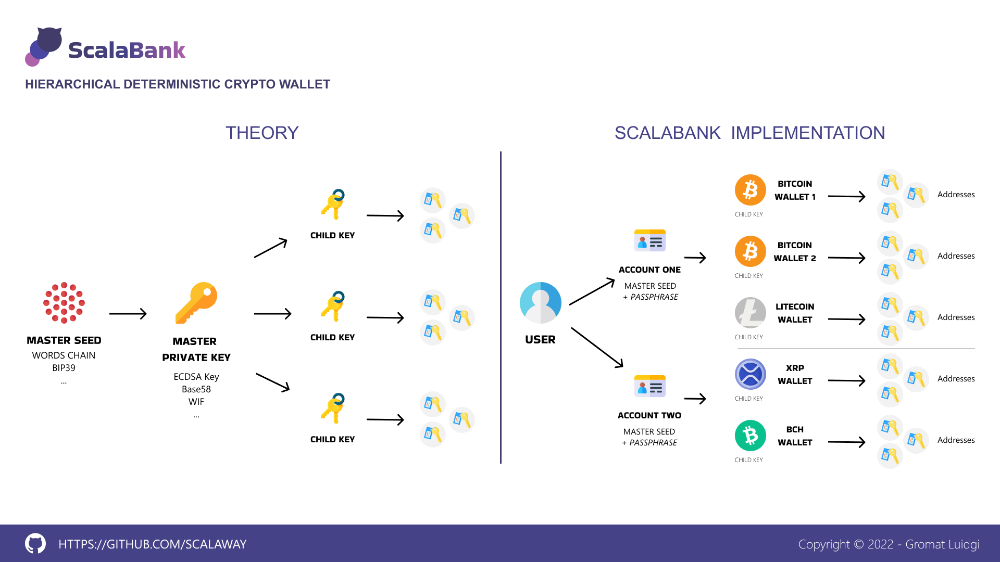
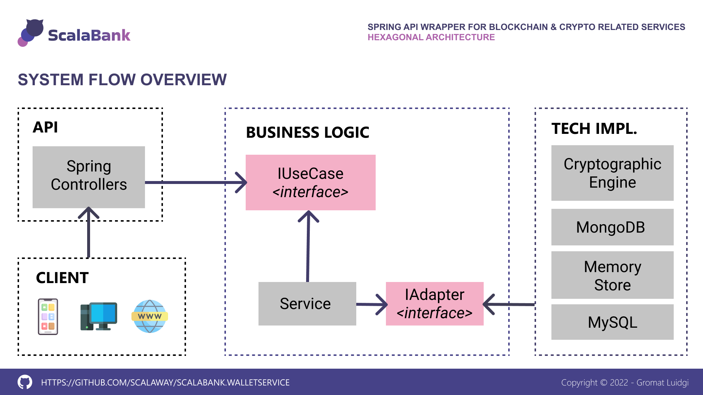
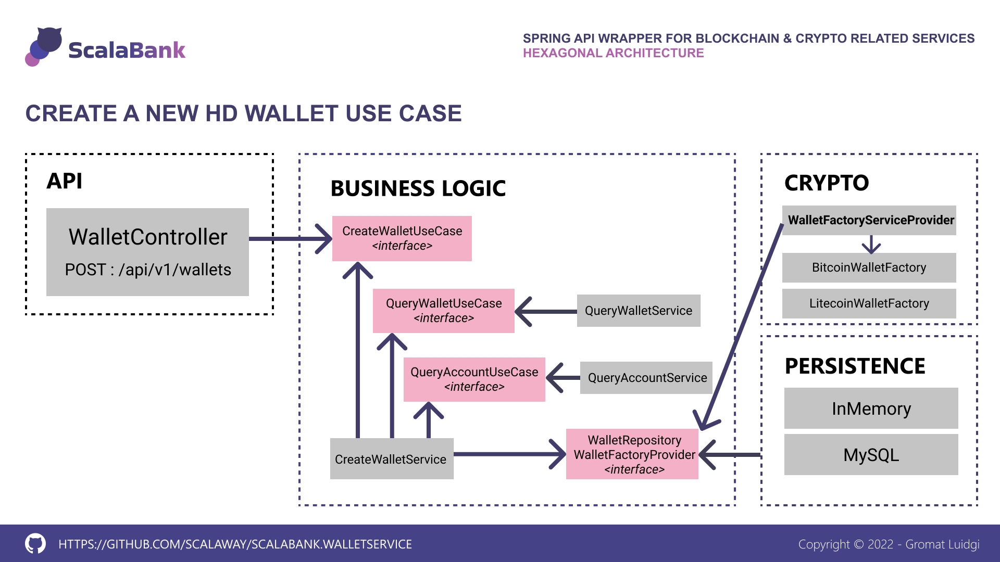

# ScalaBank - Wallet Service

## Introduction

**ScalaBank Wallet Service** is a Spring API wrapper that's facilitates **Hierarchical Deterministic Wallets** creation and management for various cryptocurrencies.

The principal aim of the project is to explore new coding practices and  technologies around blockchain.

At the moment there is no plan to release a production ready service.
Any operations are made on the **TESTNET** of targeted blockchain.

**Warning** : at this stage, security concerns are deliberately ignored.

## Context

I've got various cryptocurrencies, and it's a pain for manage all of them. And for sure, I won't delegate the management of my asset's to an external service, so I could preserve my ~~money~~ privacy. Has a full-stack developer which likes to explore new techs, why don't build my own self-managed **Hierarchical Deterministic Crypto Wallet** ?

## Technologies

- Java 11 
- Spring Boot 2
- Spring Hateos 
- Spring Security
- Spring JPA
- Bitcoinj

## Architecture overview

## Some use cases

## Why externalizing wallet and address instantiation from business logic ?

The fact is cryptocurrency existence rely on "Blockchain" concept; which can be seen has a technology built upon cryptographic principles. There are many ways to generate valid wallets (collection of addresses), that's can be used to perform ingoing and outgoing transactions.

Providing cryptographic operations with output adapters keep our business logic agnostic about whatever external process is used to perform use cases.

It's also easy to implements new cryptocurrencies without breaking the business logic :

- Implements or extends factories contract (Account / Wallet / Address...)
- Implements or extends builders contract (Account / Wallet / Address...)
  ...